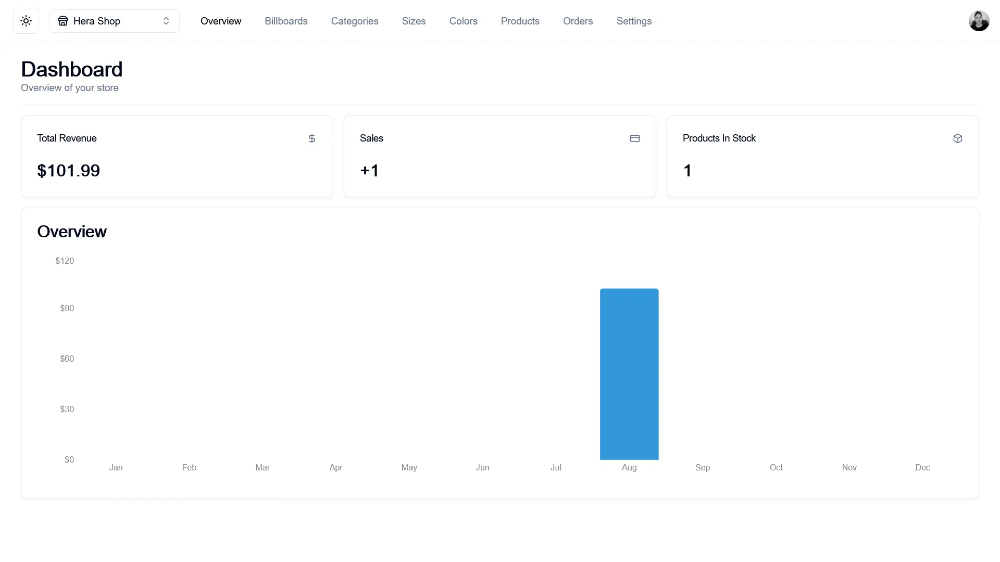

# Ecommerce Dashboard - Nextjs v13.4

This is a practical **Ecommerce Admin** project using [Next.js](https://nextjs.org/) latest features bootstrapped with [`create-next-app`](https://github.com/vercel/next.js/tree/canary/packages/create-next-app).

Explore the E-commerce [demo](https://maxjn-ecommerce.vercel.app/) and its Admin [demo](https://maxjn-ecommerce-admin.vercel.app/) for better understanding'.

You can also take a look at the project's store [repo](https://github.com/maxjn/ecommerce-store) if you want.

Database vusioalized ERD [here](https://dbdiagram.io/d/64c3cd7d02bd1c4a5ede3c37).

## Technologies

- **UI:** TSX, Tailwindcss, [Shadcn/ui](https://ui.shadcn.com/)
- TypeScript
- **Nextjs v13.4**
- **Main Packages:** Redux, Clerk, Formik, Axios
- **Secondary Packages:** HotToast, Rechart
- **DataBase:** MySQL + PlanetScale + Prisma
- **Routing:** New app directory

## Features

- **[Shadcn/ui](https://ui.shadcn.com/)** for the Pre made components!
- This admin dashboard serve as both **CMS, Admin** and **API**!
- Control **mulitple vendors / stores** through this single CMS! (For example you can have a "Shoe store" and a "Laptop store" and a "Suit store", and our CMS will generate API routes for all of those individually!)
- All **CRUD** functionalities for all **categories, products, filters (Color, Size)**!
- Upload **multiple images** for products, and change them whenever you want!
- Create, update and delete **"Billboards"** which are these big texts on top of the page. You will be able to attach them to a single category, or use them standalone (Our Admin generates API for all of those cases!)
- **Search** through all categories, products, sizes, colors, billboards with included pagination!
- Control which products are **"featured"** so they show on the homepage!
- See your orders, sales, etc.
- See graphs of your revenue etc.
- 
- Order creation
- Stripe checkout
- Stripe webhooks
- MySQL + Prisma + PlanetScale

## Installation

###### Add Environment Variables

Create **.env.local** from '.env.example' file and declare the project environment variables

Starting a development instance of the app

###### shell command

```shell
# Install Dependencies
npm install

# Connect to PlanetScale and Push Prisma
npx prisma generate
npx prisma db push

# Start the app
npm run dev
```

###### deployment command on vercel

```shell
npm run vercel-build
```

## Screenshots


